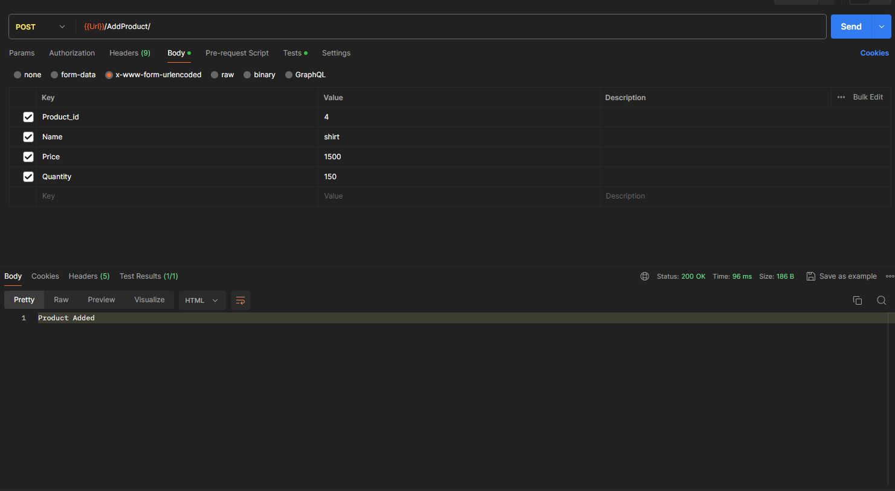
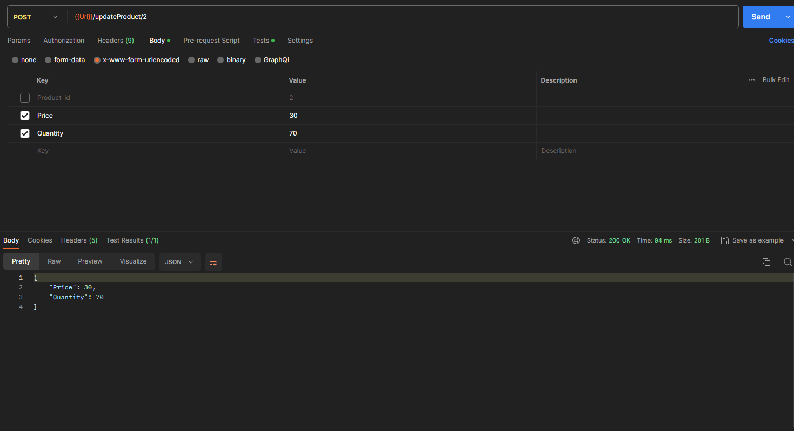
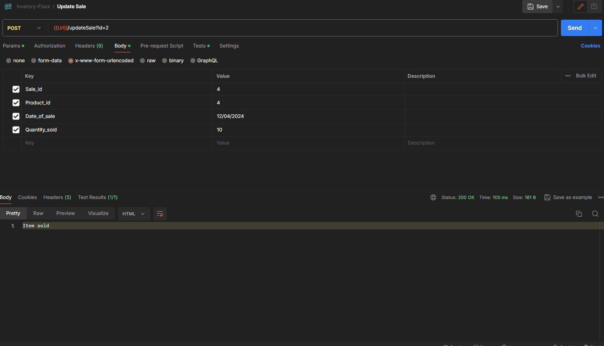
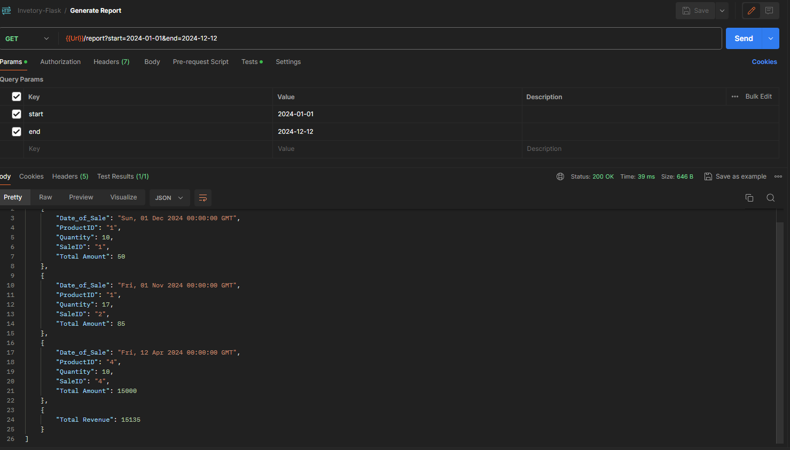

# Flask Inventory Managment project

## Python, Flask, SQLAlchemy

## Installation

First, you need to clone this repo:

```bash
$ git clone https://github.com/rozer007/Inventory_Management.git
```

Now, we will need to create a virtual environment and install all the dependencies. We have two options available for now.

Use virtualenv:

```bash
$ pip install virtualenv
```

Or use pip + virtualenv:

```bash
$ virtualenv venv
$ . venv/bin/activate  # on Windows, use "venv\Scripts\activate" instead
$ pip install -r requirements.txt
```

## How to Run the Application?

**Before run the application, make sure you have activated the virtual enviroment:**

```bash
$ flask run
```

## Screenshots

#### This shows how to add the product into the product Table using postman



#### This shows how to Update the product into the product Table using postman



#### This shows how to add sale into the Sale Table using postman



#### This shows how to generate the sale reports into the postman



### PostMan Collection Link

(https://bold-desert-167425.postman.co/workspace/New-Team-Workspace~ba038508-fbab-4305-ab10-9b18791de54f/collection/19603327-9ea95aa9-87cc-4b06-8ae5-e41963da8800?action=share&creator=19603327 Postman Collection)
